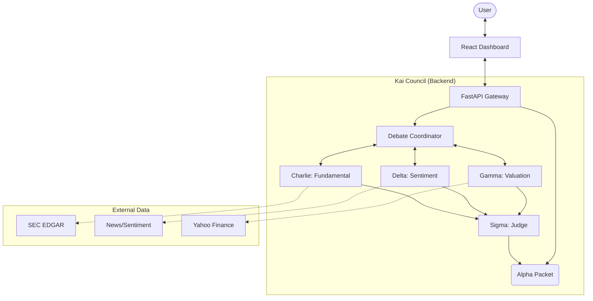

# Kai — Your Explainable Investing Copilot

**Kai** is an AI-powered investment analysis system that uses a **multi-agent debate architecture** to provide explainable, trustworthy, and data-driven investment insights. Unlike black-box models, Kai employs a "Council of Agents" — led by a Coordinator — to debate investment theses from fundamental, sentiment, and valuation perspectives before a Judge agent creates a final "Alpha Packet" for the user.

---

## 🏗 System Architecture

Kai uses a **hierarchical multi-agent (HMA)** architecture where specialist agents debate investment decisions. This ensures that every recommendation is vigorously stress-tested from multiple angles.



### The Council
- **Charlie (Fundamental)**: Analyzes SEC filings, balance sheets, and cash flow.
- **Delta (Sentiment)**: Processes news streams, market sentiment, and macro indicators.
- **Gamma (Valuation)**: Performs quantitative models (DCF, Comparables) and technical analysis.
- **Sigma (Judge)**: Synthesizes the debate, resolving conflicts and assigning confidence scores to generate the final **Alpha Packet**.

---

## 📂 Project Structure

```bash
.
├── agents/                   # Specialist ADK (Agent Development Kit) agents
│   ├── charlie_fundamental/  # Fundamental analysis agent
│   ├── delta_sentiment/      # News & sentiment agent
│   └── gamma_valuation/      # Quantitative valuation agent
├── coordinator/              # Orchestrator for inter-agent debates
├── gateway/                  # FastAPI Backend & HITL (Human-in-the-Loop) Manager
├── judge/                    # Sigma agent & AP2 (Alpha Packet) handler
├── kai-frontend/             # React/Vite Dashboard
├── mcp_server/               # Model Context Protocol tools & data fetchers
├── tests/                    # Back-testing and consistency checks
└── requirements.txt          # Python dependencies
```

---

## 🚀 Getting Started

### Prerequisites
- **Python 3.10+**
- **Node.js 18+** & **npm**
- **Groq API Key** (for LLM inference)
- **Google AI API Key** (for additional agent capabilities)

### 1. Backend Setup

1. **Clone the repository**:
   ```bash
   git clone https://github.com/yourusername/kai-economist.git
   cd kai-economist
   ```

2. **Create and activate a virtual environment**:
   ```bash
   python3 -m venv venv
   source venv/bin/activate  # On Windows: venv\Scripts\activate
   ```

3. **Install python dependencies**:
   ```bash
   pip install -r requirements.txt
   ```

4. **Configure Environment Variables**:
   Create a `.env` file in the root directory:
   ```bash
   # Create .env manually or copy from example if available
   touch .env
   ```
   Add your keys to `.env`:
   ```env
   # LLM Providers
   GOOGLE_API_KEY=your_google_key_here
   GROQ_API_KEY=your_groq_key_here

   # Server Config
   GATEWAY_HOST=0.0.0.0
   GATEWAY_PORT=8080
   
   # Security
   GATEWAY_SECRET_KEY=your_secure_random_string
   ```

### 2. Frontend Setup

1. **Navigate to the frontend directory**:
   ```bash
   cd kai-frontend
   ```

2. **Install dependencies**:
   ```bash
   npm install
   ```

3. **Start the development server**:
   ```bash
   npm run dev
   ```
   The frontend will typically run on `http://localhost:5173`.

---

## 🏃‍♂️ Usage

### Running the Backend
From the root directory (ensure your virtual environment is active):

```bash
uvicorn gateway.app:app --reload --port 8080
```
This starts the central API, which orchestrates the agents and handles the database.
- **API Docs**: `http://localhost:8080/docs`
- **Health Check**: `http://localhost:8080/health`

### Using the Dashboard
1. Open your browser to `http://localhost:5173` (or the port shown by Vite).
2. **Login/Register** (default auth uses a local SQLite database).
3. **Start an Analysis**: Enter a ticker symbol (e.g., `AAPL`, `TSLA`) and choose a risk persona (Zen, Balanced, Alpha).
4. **Watch the Debate**: The "Council" will debate in real-time. You can see the logs as Charlie, Delta, and Gamma argue their points.
5. **View Results**: Once the debate is over, Sigma will produce an "Alpha Packet" with a Buy/Hold/Sell recommendation and a confidence score.

---

## ✨ Key Features

- **Transparent Reasoning**: See exactly *why* a decision was made by reading the debate logs.
- **Risk Personas**:
    - 🧘 **Zen**: Conservative, focuses on long-term value and dividends.
    - ⚖️ **Balanced**: Standard growth-at-a-rational-price approach.
    - 🚀 **Alpha**: Aggressive, focuses on high-growth and momentum.
- **Human-in-the-Loop (HITL)**: For high-stakes decisions, the system can pause and request human approval.
- **AP2 Protocol**: Uses "Alpha Packet" standards for verifiable investment mandates.

---

## 🛠 Tech Stack

- **Backend**: Python, FastAPI, Pydantic, SQLAlchemy
- **Frontend**: React, Vite, Bootstrap, Recharts
- **AI/LLM**: Groq (Llama 3), Google Gemini (via ADK)
- **Data**: Yahoo Finance (yfinance), SEC EDGAR
- **Database**: SQLite (Development), PostgreSQL (Production ready)

---

## 📄 License
TBD
